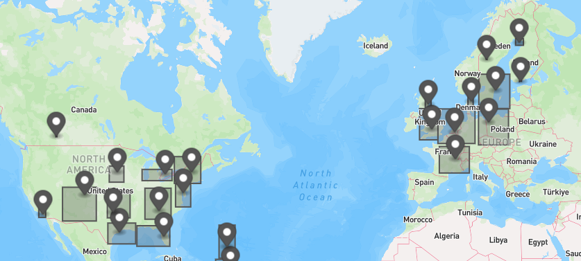

Released asset clustering in the GraphQL API.

The new `assetClusters` field supports obtaining clusters of assets based on their current location. Useful for drawing a map of clusters of assets.

It accepts the same `AssetFiltersInput` as the `assets` search field, so they can easily be combined if needed.

> ➕ GQL: `Query.assetClusters`

[See all relevant GQL documentation](https://developers.trackunit.com/reference/graphql-api-introduction)

