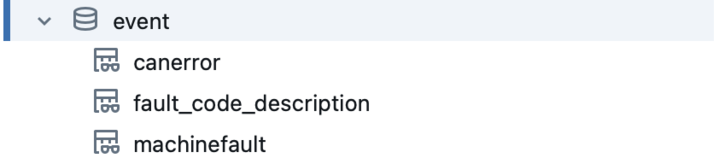

## Access, query, and store data in the IrisX Data Lake
IrisX Analytics allows you to access, query, and store data from and into the IrisX Data Lake. To access the IrisX Data Lake through the IrisX Analytics interface, select “Catalog” from the left-hand navigation menu.

Here you will see a handful of different catalogs:

- irisx - this catalog contains all your Trackunit Manager data collected through Iris as well as additional datasets that are available as part of IrisX.
- <your_account_name>-<random_string>, e.g. tuconstruction_zq6qt8 - this catalog is your own space to store data, insights, models, files, etc. in the IrisX Data Lake.
- hive_metastore, samples, system - these catalogs are part of the IrisX Analytics environment and contain metadata, configurations, etc. that keep everything running smoothly. As an IrisX user, you don’t need to access these catalogs.
# General structure of the IrisX data catalog

The irisx catalog contains the datasets provided by Trackunit for the IrisX Analytics workspace. The datasets in this catalog are read-only to ensure a consistent foundation to build on.

The current list of schemas can be seen here:

## Access Management

The key view in the access_management schema contains records of access keys for machines, their period of validity and other data about the key and the access it provides.

**Links to other tables**

key:

    account_id → irisx.account.account.account_id
    asset_id → irisx.asset.asset.asset_id
    site_id → irisx.site.site.site_id

## Accounts

The accounts schema contains information about the Trackunit accounts associated with the IrisX instance and the customers associated with those accounts. The views account and customer contain information about these.
The account_asset view contains information about which assets a given account has access to.
Similarly the customer_asset view contains information about which assets the a given customer has access to.
Finally the customer_contacts view contains information about the contacts, and their information, for a given customer.

**Links to other tables**

account_asset:

    account_id → irisx.account.account.account_id
    asset_id → irisx.asset.asset.asset_id

customer_asset:

    customer_id → irisx.account.customer.customer_id
    asset_id → irisx.asset.asset.asset_id

customer_contacts:

    customer_id → irisx.account.customer.customer_id

## Advanced Sensor Data

Specific timeseries data that is not aligned as insights can be found in the advanced sensor schema. The view advanced_sensor contains all the measurements from the sensor. The advanced_sensor_latest contains just the latest values.
The advanced_sensor_info contains meta data about the sensor.

Note: A series of values from a unique sensor is identified by the key (asset_id, name_id).

**Links to other tables**

advanced_sensor, advanced_sensor_infor, advanced_sensor_latest:

    asset_id → irisx.asset.asset.asset_id

## Assets

The asset view is core to the datasets provided in IrisX and many other views refer to this. The asset view contains detailed information about assets.
The asset_custom_fields and asset_custom_fields_account_specific views contains data for the custom fields values set on the assets.

Note: When defining a custom field on an account in TU Manager data for these custom fields will be present in the account specific view.

**Links to other tables**

asset_custom_fields:

    asset_id → irisx.asset.asset.asset_id

asset_custom_fields_account_specific:

    account_id → irisx.account.account.account_id
    asset_id → irisx.asset.asset.asset_id

## Dimensions

The dimensions schema includes information about the time intervals used for insights. These three views and the time intervals they represent align with the insights time series view of the same interval.

## Events

The events schema contains a number of views that holds different types of event data.

`canerror`:  Errors from the J1939 protocol

    asset_id → irisx.asset.asset.asset_id
    account_id → irisx.account.account.account_id
    fault_code, asset_id → irisx.event.fault_code_description.fault_code, asset_id

`machinefault`: Custom/CAN Open/AEMP faults

    asset_id → irisx.asset.asset.asset_id
    account_id → irisx.account.account.account_id
    fault_code, asset_id → irisx.event.fault_code_description.fault_code, asset_id

`fault_code_description`: Translations of an asset `fault_code` to a fault description.

    Key: asset_id, fault_code

## Groups

The group schema contains information about groups of assets and groups of users.

**Links to other tables**

group:

    account_id → irisx.account.account.account_id

group_asset:

    asset_id → irisx.asset.asset.asset_id
    group_id → irisx.group.group.group_id

group_user:

    group_id → irisx.group.group.group_id
    user_id → irisx.user.user.user_id

## Information Schema

This schema contains meta information about the schemas, tables, views and other objects in the catalog. This schema does not contain information about machines or equipment, but data about the structure of the catalog.

## Insights

Insights are aligned timeseries data measured on the tracked equipment/machines. For example the total number of running hours or the current speed. An insight is aligned over different manufacturers, machines types and measuring units to be easily comparable across machines.

The insights schema contains a large number of tables as there is a set of tables for each insight. This is done to make the data easy to use.

For each insight there are five tables. Below the five tables for the insight acaveragefrequency is shown. There is table containing all measurements (acaveragefrequency) and one that only contains the latest measurement for each asset (acaveragefrequency_latest).
The last three tables have the measurements aligned for either 2 minute intervals, hourly intervals and daily intervals. When combining different insights use these three tables as here the timestamps are aligned across the insights.

For detailed information on each individual insight look here: https://developers.trackunit.com/reference/data-model

**Links to other tables (for all insights tables)**

    asset_id → irisx.asset.asset.asset_id

## Sites

Sites are geographical locations that can contain machines and equipment. Sites can be of the following types: CONSTRUCTION_SITE, DEPOT, WORK_PLACE, AREA, CLASSIC_ZONE, CLASSIC_POI.

**Links to other tables**

site

    account_id → irisx.account.account.account_id

site_asset

    site_id → irisx.site.site.site_id
    asset_id → irisx.asset.asset.asset_id
    account_id → irisx.account.account.account_id

site_custom_fields

    site_id → irisx.site.site.site_id
    account_id → irisx.account.account.account_id

site_custom_fields_account_specific

    site_id → irisx.site.site.site_id
    account_id → irisx.account.account.account_id

## Telematics Devices

This schemas contains information about the telematics devices installed in machines. A telematics device refers to the hardware unit that tracks the machine.

Information about the hardware unit is found in `telematics_device`, and information about account transfers are found `telematics_device_account_transfer`.

**Links to other tables**

telematics_device:

    asset_id → irisx.asset.asset.asset_id

telematics_device_account_transfer:

    hardware_serial_number → irisx.telematics_device.telematics_device.hardware_serial_number

## Users

The users schema contains a single table - the user table, which contains information about the users of Trackunit Manager.

**Links to other tables**

user:

    account_id → irisx.account.account.account_id
